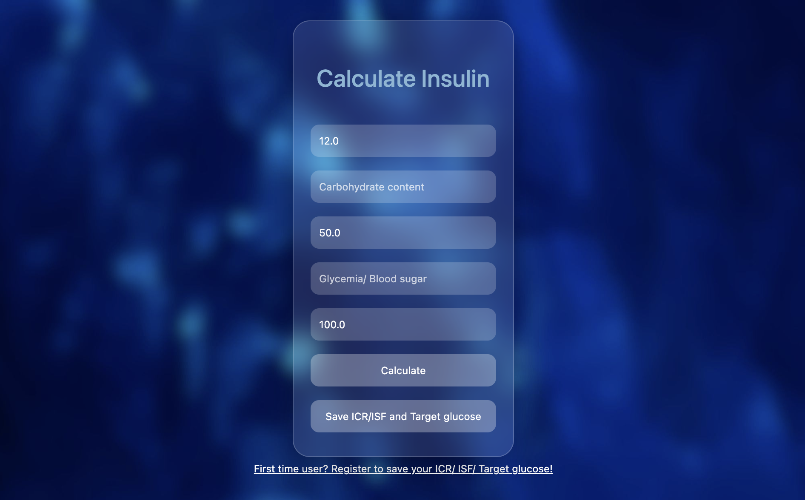
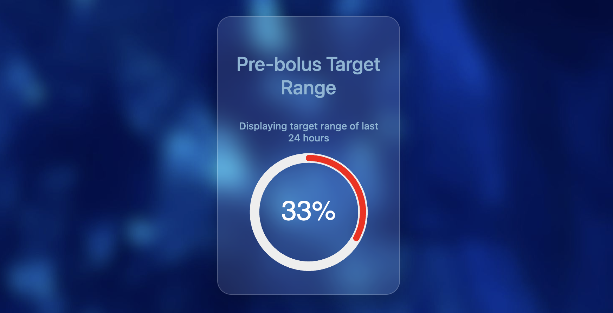
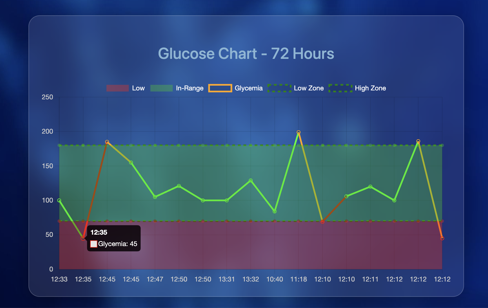
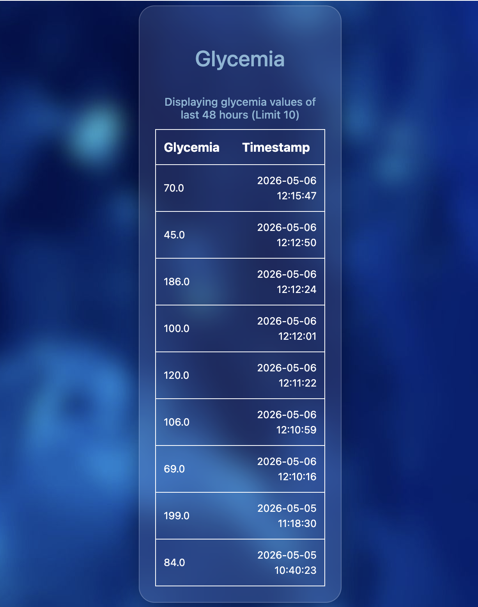

# Glucose Management Web App

#### Video Demo: https://youtu.be/rDApI8C6e8s?is=O20nFxRszIN1IxRV

#### Educational Project Disclaimer

This application was developed as an educational project for Harvard CS50x and is not intended for medical use, diagnosis, treatment, or clinical decision-making.

#### Screenshots

#### Insulin Calculator

#### Dashboard

Interactive glucose monitoring dashboard with 72-hour trend visualization and 24-hour time-in-range analysis.

#### Description:

My project consists of a web application designed to help diabetic patients calculate insulin dosage accurately before
meals.

By allowing users to input blood glucose levels and carbohydrate intake, the application computes the appropriate
insulin dosage using medically established parameters. These include ICR (Insulin Carbohydrate Ratio), ISF (Insulin
Sensitivity Factor), and target glucose levels.

As users input their glucose values, the application stores these logs on a database. This data is then displayed through
charts and tables, which are essential for diabetes management. Tracking glucose levels before and after meals or
physical activity allows users to better understand and control their condition.

The application includes two main visualizations:

* A circular SVG chart displaying the percentage of time spent within the target glucose range over the last 24 hours.

* A line chart showing glucose trends over the last 72 hours, highlighting patterns and fluctuations.

Additionally, a table displays the 10 most recent glucose readings along with timestamps.

These visualizations provide insights similar to Continuous Glucose Monitors (CGM), helping users and healthcare
providers identify trends and make informed decisions.

The app also supports user registration, personalized settings, and password reset functionality using secure tokens.

#### Features

The insulin calculation feature uses three pre-establised medical values:

* ICR (Insulin Carbohydrate Ratio)

* ISF (Insulin Sensitivity Factor)

* Target Glucose

These values are typically provided by healthcare professionals and can be updated at any time. They ensure that
insulin dosing is accurate and reduce the risk of underdosing or overdosing.

In addition, the user inputs:

* Carbohydrate content of the meal

* Current blood glucose level

All glucose values entered are automatically logged and used to generate dynamic charts.

Registered users can store their personal medical settings, which are automatically preloaded on the calculation page.
This improves usability and allows for faster daily interaction.

The line chart visually distinguishes glucose levels using color coding:

* Green: within safe range (70 - 180)

* Orange: above range (hyperglycemia)

* Red: below range (hypoglycemia)

This makes it easier to identify dangerous patterns and analyze trends.

Users can interact with the chart by hovering over points to view exact values  and timestamps.

The time-in-range circular chart helps users evaluate how effective their insulin dosage has been over time.

The application also includes a password reset system using secure tokens generation. While currently functional, this
feature is designed for future integration with email services.

#### Technologies Used

* Python (Flask framework)

* SQLite database

* JavaScript (Chart.js for data visualization)

* HTML & CSS (Glass UI design)

#### Application flow

Users can calculate insulin dosage without creating an account. This allows quick access and lowers the barrier to
entry.

When logged in, users can:

* Save and update medical settings

* Automatically log glucose values

* View personalized charts and data

The line chart updates dynamically whenever a new glucose value is entered. It reflects real time trends and uses
color-coded zones to represent safe and unsafe glucose levels.

The 24-hour circular chart focuses on short-term control (time-in-range), while the 72-hour line chart provides a broader
view of glucose trends. This separation improves clarity and mirrors real-world monitoring approaches.

Although the application does not collect continuous data like CGM devices, it presents manually entered data in a
structured and meaningful way. Finger-prick measurements are highly accurate, and when logged consistently, can
provide valuable insights for both users and healthcare professionals.

#### Challenges

Several challenges were encountered during development:

* Jinja JSON issue:
  An error occurred when rendering logs due to incorrect use of tojson combined with JSON.parse(). This was
  resolved by properly passing JSON data directly to JavaScript.

* Handling NULL values:
  Missing values from the database caused crashes when converting to float. This was fixed by implementing default
  values and conditional checks.

* Session and flash messages:
  Flash messages were not displaying correctly due to session.clear() being called at the wrong time. Adjusting
  session handling resolved the issue.

* Chart disappearing bug:
  The chart on the calculation page disappeared after form submission. This was caused by logs not being reloaded.
  The issue was fixed by ensuring logs are always passed to template.

* CSS layering issue:
  Flash messages were unintentionally blocking user interaction due to conflicting pointer-events settings. This was
  resolved by disabling pointer events on the flash container.

#### Design Choices

From the beginning, the application was intentionally designed to differ from traditional medical interfaces.

Since many Type 1 diabetes patients are diagnosed at a young age, the goal was to create an interface that feels
modern and engaging rather than clinical. A dark theme with glass-style components was chosen to create a visually
appealing and user-friendly experience.

The landing page was kept simple and focused on quick calculations, as this is the most frequently used feature. More
detailed analytics were placed on a separate history page to avoid overwhelming the user.

#### Future Improvements

* Email integration for password reset

* Mobile responsiveness

* Ability to export or share glucose logs with healthcare providers

* User interface customization (Themes and backgrounds)

#### What I Learned

Through this project I gained practical experience with:

- Flask application architecture
- User authentication
- Session management
- SQLite databases
- Data visualization using Chart.js
- Git and GitHub workflows
- Debugging complex application issues

